% Concurso Programacion 3
% Tecnicatura Universitaria en Inteligencia Artificial
% Dámian Ariel Marotte

# Algoritmos de Búsqueda

## Definicion

Un algoritmo de búsqueda es un algoritmo que toma como entrada un problema y
devuelve una solución de la forma secuencia de acciones.

Para que un problema quede bien definido, necesitamos especificar los
siguientes componentes:

. . .

### Estado Inicial

Necesitamos definir cual es el estado a partir del cual empezamos a resolver
el problema.

. . .

### Funciones sucesores

Tambien necesitamos hacer una lista de todas las posibles transofrmaciones
sobre los estados, esto es, cada una de las acciones que podrian acercarnos
a la solucion.

. . .

### Test objetivo

Finalmente necesitamos una funcion que dado un estado, nos indique si se trata
de una solucion al problema, o no.

## Ejemplo

Un terrorista ha colocado una boma. En el lugar se encuentran disponibles un
bidon con capacidad para 3 litros y otro para 5 litros. Para desactivar la
bomba es necesario apoyar un bidon con exactamente 4 litros sobre una balanza.

. . .

### Estado Inicial

Partimos de un estado donde ambos bidones se encuentran vacios.

. . .

### Funciones sucesores

Las acciones que podemos realizar son:

* Vaciar el bidon de 3 litros.
* Vaciar el bidon de 5 litros.
* Llenar el bidon de 3 litros.
* Llenar el bidon de 5 litros.
* Volcar el bidon de 5 litros en el de 3.
* Volcar el bidon de 3 litros en el de 5.

. . .

### Test objetivo

Podemos determinar si hemos llegado a la solucion observando si hay 4 litros
en el bidon mas grande.

## ¿Como buscar?

Una vez que tenemos definido nuestro problema, podemos buscar una solucion
confeccionando un grafo de busqueda y recorriendo cada uno de sus nodos.

En un grafo de busqueda cada uno de los nodos corresponde con un posible estado
del problema, y cada arista es una de las acciones disponibles en el.

. . .

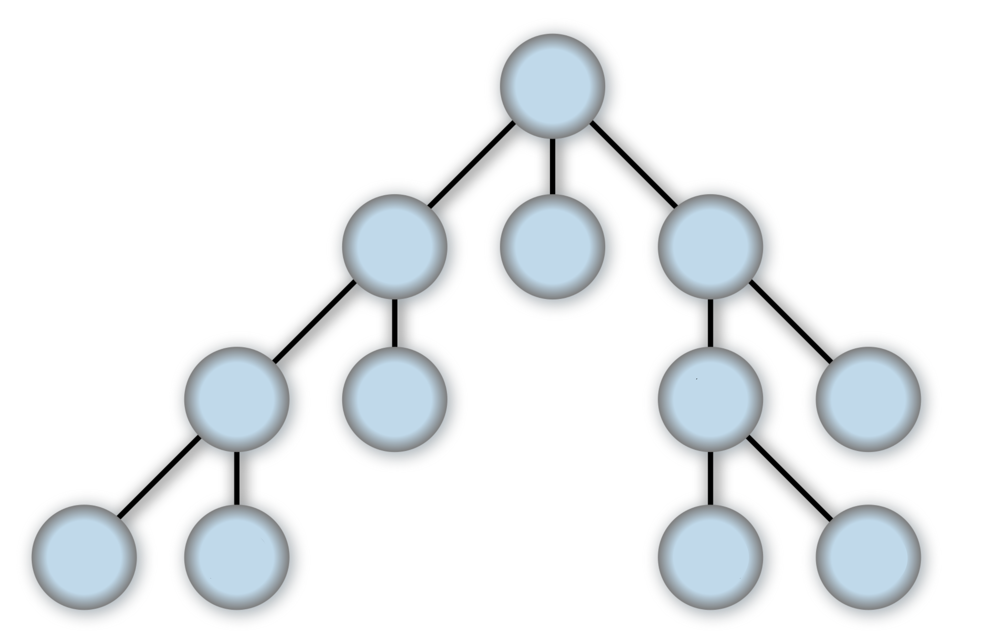{width=60%}

------------------------------

### Recorrido en profundidad

La idea de un recorrido en profundidad es expandir siempre el nodo mas
profundo del grafo hasta que ya no sea posible, en cuyo caso se vuelve hacia
atras y se continua con el siguiente.

. . .

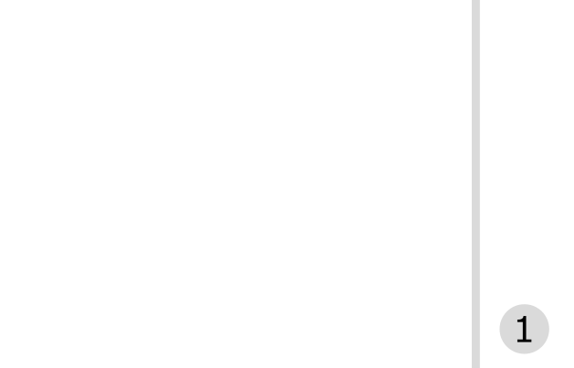{width=60%}

------------------------------

### Recorrido en profundidad

La idea de un recorrido en profundidad es expandir siempre el nodo mas
profundo del grafo hasta que ya no sea posible, en cuyo caso se vuelve hacia
atras y se continua con el siguiente.

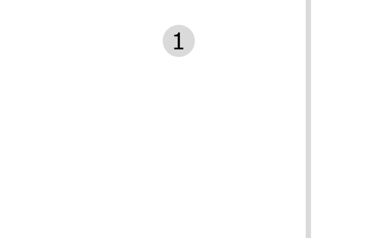{width=60%}

------------------------------

### Recorrido en profundidad

La idea de un recorrido en profundidad es expandir siempre el nodo mas
profundo del grafo hasta que ya no sea posible, en cuyo caso se vuelve hacia
atras y se continua con el siguiente.

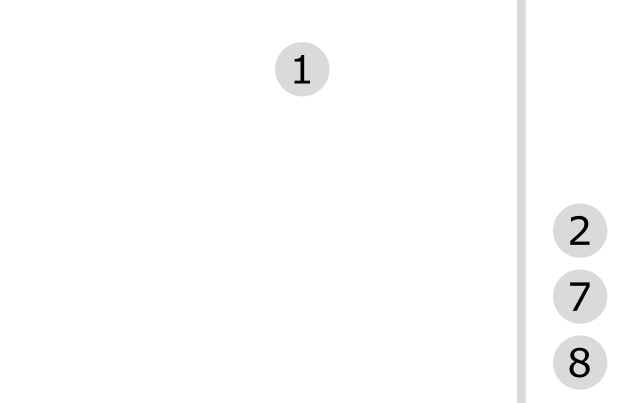{width=60%}

------------------------------

### Recorrido en profundidad

La idea de un recorrido en profundidad es expandir siempre el nodo mas
profundo del grafo hasta que ya no sea posible, en cuyo caso se vuelve hacia
atras y se continua con el siguiente.

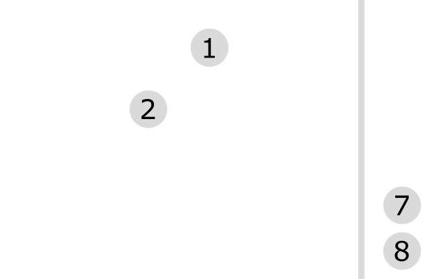{width=60%}

------------------------------

### Recorrido en profundidad

La idea de un recorrido en profundidad es expandir siempre el nodo mas
profundo del grafo hasta que ya no sea posible, en cuyo caso se vuelve hacia
atras y se continua con el siguiente.

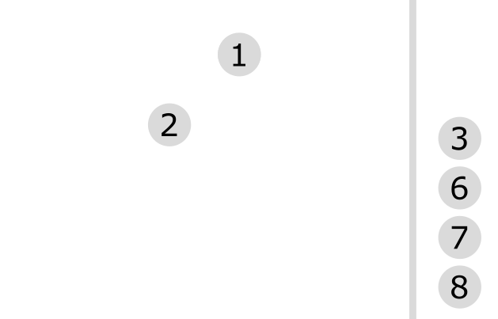{width=60%}

------------------------------

### Recorrido en profundidad

La idea de un recorrido en profundidad es expandir siempre el nodo mas
profundo del grafo hasta que ya no sea posible, en cuyo caso se vuelve hacia
atras y se continua con el siguiente.

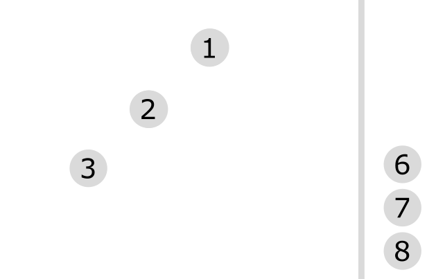{width=60%}

------------------------------

### Recorrido en profundidad

La idea de un recorrido en profundidad es expandir siempre el nodo mas
profundo del grafo hasta que ya no sea posible, en cuyo caso se vuelve hacia
atras y se continua con el siguiente.

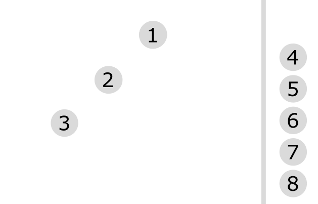{width=60%}

------------------------------

### Recorrido en profundidad

La idea de un recorrido en profundidad es expandir siempre el nodo mas
profundo del grafo hasta que ya no sea posible, en cuyo caso se vuelve hacia
atras y se continua con el siguiente.

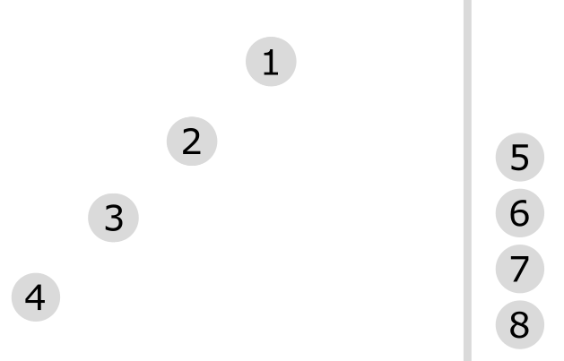{width=60%}

------------------------------

### Recorrido en profundidad

La idea de un recorrido en profundidad es expandir siempre el nodo mas
profundo del grafo hasta que ya no sea posible, en cuyo caso se vuelve hacia
atras y se continua con el siguiente.

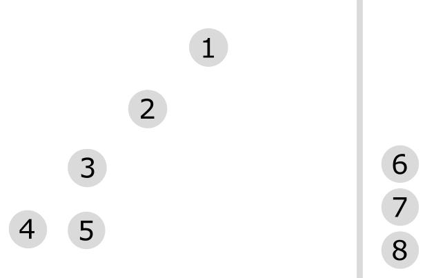{width=60%}

------------------------------

### Recorrido en profundidad

La idea de un recorrido en profundidad es expandir siempre el nodo mas
profundo del grafo hasta que ya no sea posible, en cuyo caso se vuelve hacia
atras y se continua con el siguiente.

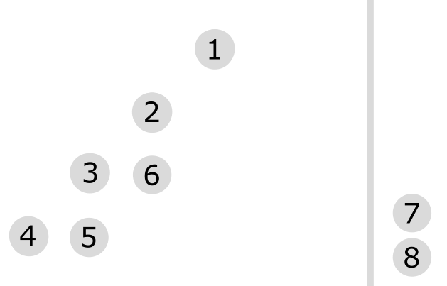{width=60%}

------------------------------

### Recorrido en profundidad

La idea de un recorrido en profundidad es expandir siempre el nodo mas
profundo del grafo hasta que ya no sea posible, en cuyo caso se vuelve hacia
atras y se continua con el siguiente.

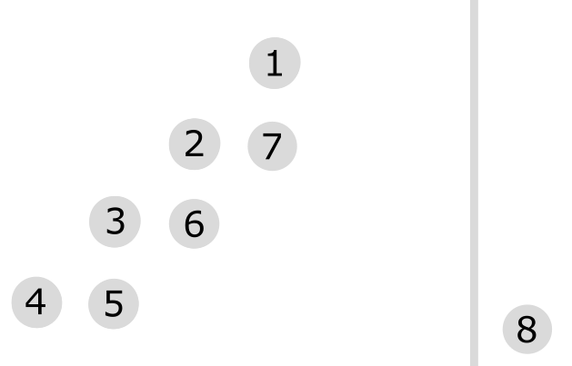{width=60%}

------------------------------

### Recorrido en profundidad

La idea de un recorrido en profundidad es expandir siempre el nodo mas
profundo del grafo hasta que ya no sea posible, en cuyo caso se vuelve hacia
atras y se continua con el siguiente.

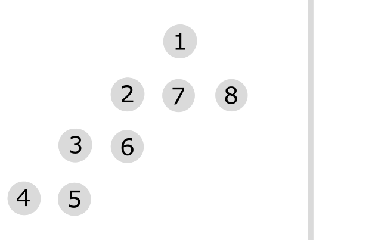{width=60%}

------------------------------

### Recorrido en profundidad

La idea de un recorrido en profundidad es expandir siempre el nodo mas
profundo del grafo hasta que ya no sea posible, en cuyo caso se vuelve hacia
atras y se continua con el siguiente.

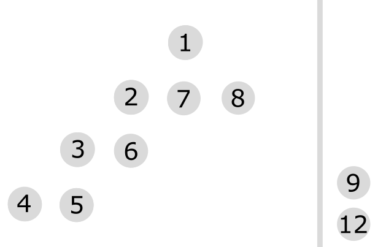{width=60%}

------------------------------

### Recorrido en profundidad

La idea de un recorrido en profundidad es expandir siempre el nodo mas
profundo del grafo hasta que ya no sea posible, en cuyo caso se vuelve hacia
atras y se continua con el siguiente.

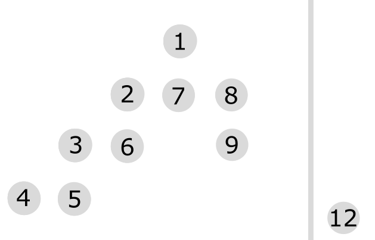{width=60%}

------------------------------

### Recorrido en profundidad

La idea de un recorrido en profundidad es expandir siempre el nodo mas
profundo del grafo hasta que ya no sea posible, en cuyo caso se vuelve hacia
atras y se continua con el siguiente.

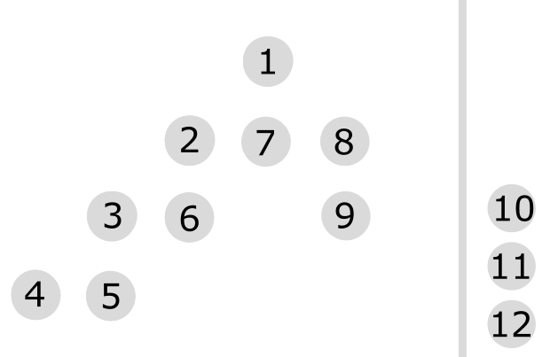{width=60%}

------------------------------

### Recorrido en profundidad

La idea de un recorrido en profundidad es expandir siempre el nodo mas
profundo del grafo hasta que ya no sea posible, en cuyo caso se vuelve hacia
atras y se continua con el siguiente.

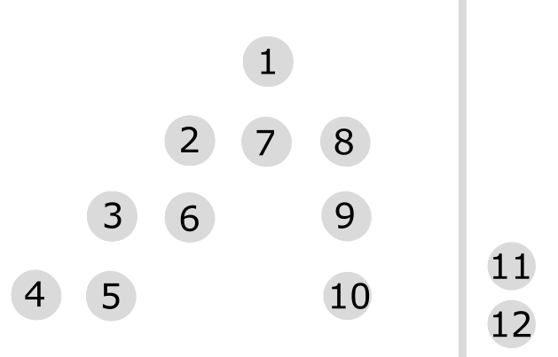{width=60%}

------------------------------

### Recorrido en profundidad

La idea de un recorrido en profundidad es expandir siempre el nodo mas
profundo del grafo hasta que ya no sea posible, en cuyo caso se vuelve hacia
atras y se continua con el siguiente.

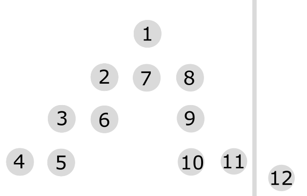{width=60%}

------------------------------

### Recorrido en profundidad

La idea de un recorrido en profundidad es expandir siempre el nodo mas
profundo del grafo hasta que ya no sea posible, en cuyo caso se vuelve hacia
atras y se continua con el siguiente.

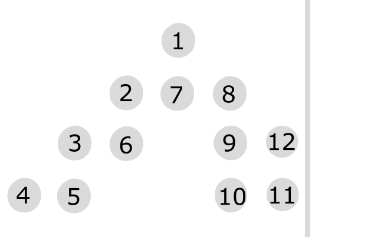{width=60%}

------------------------------

### Recorrido en profundidad

La idea de un recorrido en profundidad es expandir siempre el nodo mas
profundo del grafo hasta que ya no sea posible, en cuyo caso se vuelve hacia
atras y se continua con el siguiente.

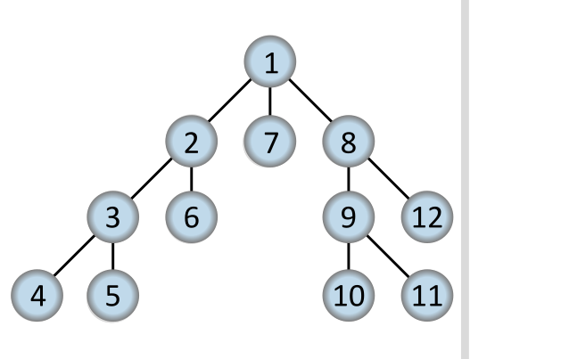{width=60%}

------------------------------

### Recorrido en anchura

La búsqueda primero en anchura es una estrategia sencilla en la que se expande
primero el nodo raíz, a continuación se expanden todos los sucesores del nodo
raíz, después sus sucesor, etc.

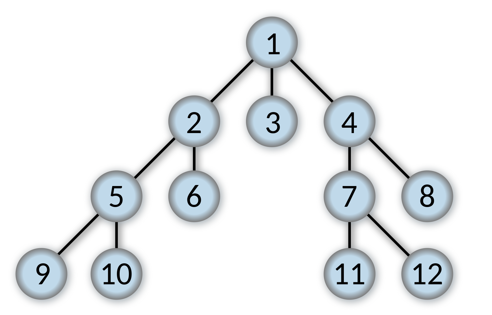{width=60%}
